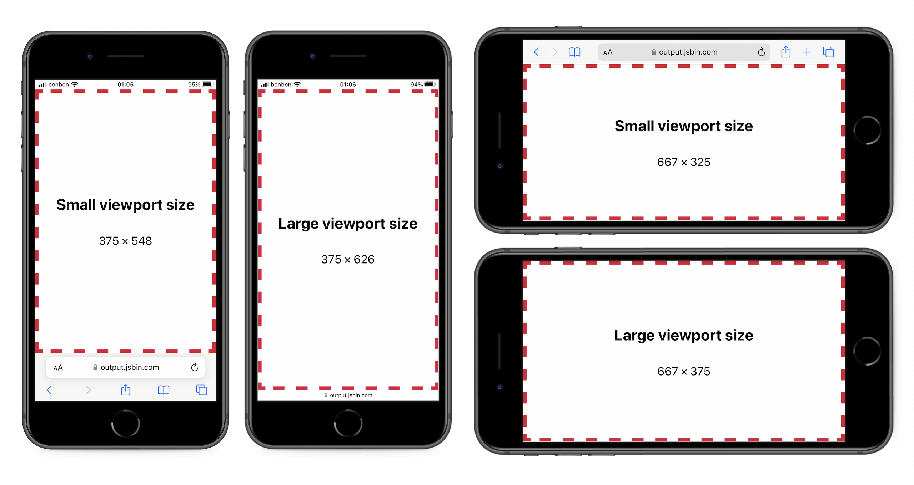
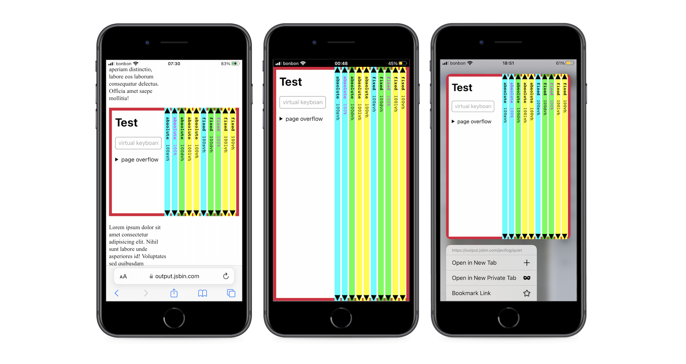
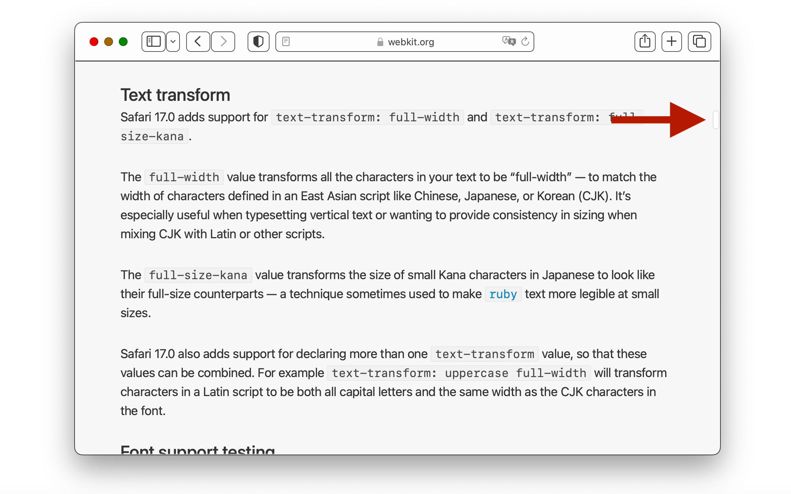
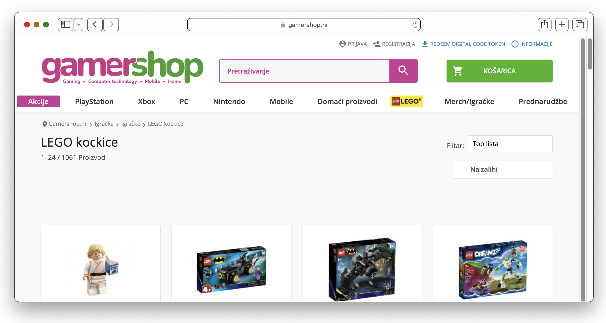
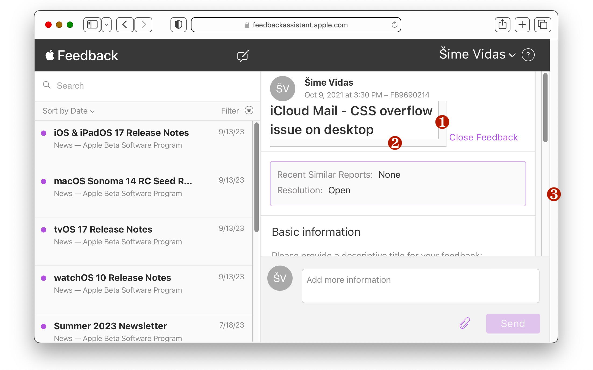
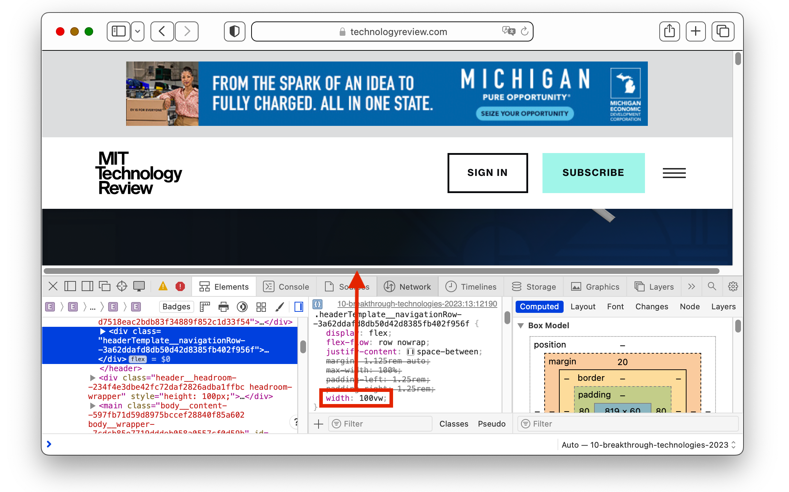

<div class="important">This is an unpubished article</div>

# The new CSS viewport units did not solve the classic scrollbar problem

In 2022, browsers shipped a new set of CSS viewport units. These units make it easier to size elements in mobile browsers, where the browser’s retractable UI affects the height of the viewport as the user scrolls the page. Unfortunately, the new units do _not_ make it easier to size elements in desktop browsers, where classic scrollbars affect the width and height of the viewport.

The following video shows a desktop browser with classic scrollbars. As we resize the viewport (dashed line) in different ways, the CSS length `100dvw` matches the width of the viewport in all situations _except_ when a vertical classic scrollbar is present on the page. In that case, `100dvw` is larger than the viewport width. This is the **classic scrollbar problem** of CSS viewport units.

<figure>
  <video controls src="media/problem.mp4"></video>
  <figcaption>When the page has a vertical classic scrollbar, the length <code>100dvw</code> is larger than the viewport width. All viewport units have this problem.</figcaption>
</figure>

Before discussing the solutions and workarounds to the classic scrollbar problem, we should familiarize ourselves with all the relevant concepts, which include the visual and layout viewport, the two types of zoom, the initial containing block, the original and new viewport units, and the two types of scrollbars.

## The visual and layout viewports

The viewport is the rectangular section of the web browser in which the web page is rendered. For example, when a web page loads in Safari on an iPhone SE, the viewport has a width of 375 CSS pixels and a height of 548 CSS pixels. This size is called the **“small viewport size”**. If the user then scrolls the page, causing the browser’s UI to retract, the height of the viewport increases to 626 CSS pixels, an additional 78 pixels. This size is called the **”large viewport size”**.

**Note:** The width and height of the viewport is measured in CSS pixels, not device pixels. On most modern displays, especially on mobile devices, one CSS pixel consists of two or more device pixels.

If the user rotates their device, and the operating system switches to landscape mode, the size of the viewport changes (it becomes more wide than it is tall), but there is again a small and large viewport size.

<figure>
    
</figure>

In desktop browsers, the size of the viewport can change as well (e.g., when the user resizes the browser window, opens the browser’s side bar, or zooms the page), but there is no separate “small viewport size” and “large viewport size” like in mobile browsers.

So far I’ve only talked about “the viewport”, but there are in fact two different viewports in web browsers: the visual viewport and the layout viewport. When the page initially loads in the browser, the visual viewport and the layout viewport have the exact same size and position. The two viewports diverge in the following two cases:

1. When the user zooms in on a part of the page via a pinch-to-zoom or double-tap gesture, the part of the page that is visible on the screen is the visual viewport. The size of the visual viewport (in CSS pixels) has decreased because it shows a smaller part of the page. The size of the layout viewport has not changed.

2. When the browser’s virtual keyboard appears on mobile platforms, the smaller part of the page that is visible on the screen above the keyboard is once again the visual viewport. The height of the visual viewport has decreased by the height of the virtual keyboard. The size of the layout viewport has again not changed.

   **Note:** As part of shipping the new viewport units in 2022, Chrome [stopped resizing the layout viewport](https://twitter.com/bramus/status/1574495892010418180) and initial containing block (ICB) when the virtual keyboard is shown. This behavior is considered the “[the best default](https://groups.google.com/a/chromium.org/g/blink-dev/c/ge7xTu-VhJ0/m/hq_kcusHAQAJ)”, and it ensures that the new viewport units are consistent across browsers. This change also [made the mobile web feel less janky](https://github.com/w3c/csswg-drafts/issues/4329#issuecomment-542615096) because resizing the ICB is a costly operation. However, the virtual keyboard may still resize the layout viewport in [some mobile browsers](https://mastodon.social/@simevidas/110844733740544334).

In these two cases, the visual viewport continues to be “the rectangular section of the web browser in which the web page is rendered”, while the layout viewport becomes a larger rectangle that is only partially visible on the screen and that completely encloses the visual viewport. In all other situations, both viewports have the same size and position.

One benefit of the two-viewport system is that when the user pinch-zooms and pans around the page, fixed-positioned elements don’t stick to the screen, which would almost always be a bad experience. That being said, there are valid use-cases for positioning an element above the virtual keyboard (e.g., a floating action button). The CSS Working Group is [currently discussing](https://github.com/w3c/csswg-drafts/issues/7475) how to make this possible in CSS.

CSS viewport units are based on the layout viewport, and they are unaffected by changes to the size of the visual viewport. Therefore, I will focus on the layout viewport in this article. For more information about the visual viewport, see the widely supported [Visual Viewport API](https://developer.mozilla.org/en-US/docs/Web/API/Visual_Viewport_API).

## The two types of zoom

The two types of zoom are defined in the [CSSOM View module](https://drafts.csswg.org/cssom-view/#zooming):

> There are two kinds of zoom, page zoom which affects the size of the initial viewport, and the visual viewport scale factor which acts like a magnifying glass and does not affect the initial viewport or actual viewport.

Page zoom is available in desktop browsers, where it can be found in the browser’s menu under the names “Zoom in” and “Zoom out”, or just “Zoom”. When the page is “zoomed in”, the size of the layout viewport shrinks, which causes the page to [reflow](https://developer.mozilla.org/en-US/docs/Glossary/Reflow). If the page uses CSS media queries to adapt to different viewport widths (responsive web design), those media query breakpoints will be triggered by page zoom.

Scale-factor zoom is available on all platforms. It is most commonly performed via a pinch-to-zoom gesture on the device’s touch screen (smartphone, tablet) or touch pad (laptop). As I mentioned in the previous section, when zooming in on a part of the page, the size of the layout viewport does not change, so the page does not reflow.

<div tabindex="0">

|                |            Page zoom            |    Visual viewport scale factor     |
| :------------: | :-----------------------------: | :---------------------------------: |
| Available on…  |        desktop platforms        |            all platforms            |
|   Activation   |  keyboard command, menu option  | pinch-to-zoom or double-tap gesture |
|    Resizes…    | both layout and visual viewport |        only visual viewport         |
| Causes reflow? |               Yes               |                 No                  |

</div>

## The layout viewport and the initial containing block

The **layout viewport** is the “[containing block](https://drafts.csswg.org/css-display/#containing-block)” for fixed-positioned elements. In other words, fixed-positioned elements are positioned and sized relative to the layout viewport. For this reason, the layout viewport can be viewed as the “position fixed viewport”, which may even be [a better name for it](https://youtu.be/xl9R8aTOW_I?t=272).

```css
/* this element completely covers the layout viewport */
.elem {
  position: fixed;
  top: 0;
  bottom: 0;
  left: 0;
  right: 0;
}
```

**Tip:** Instead of `top: 0`, `bottom: 0`, `left: 0`, and `right: 0`, you can write `inset: 0`. The [`inset` property](https://drafts.csswg.org/css-position-3/#propdef-inset) is a shorthand property for the `top`, `bottom`, `left`, and `right` properties, and it’s supported in all major browsers since April 2021.

The **[initial containing block](https://drafts.csswg.org/css2/#initial-containing-block) (ICB)** is a rectangle that is positioned at the top of the web page. The ICB has a static size, which is the “small viewport size”. When a web page initially loads in the browser, the layout viewport and the ICB have the exact same size and position. The two rectangles diverge only when the user scrolls the page: The ICB scrolls out of view, while the layout viewport remains in view and, in the case of mobile browsers, grows to the “large viewport size”.

The ICB is the default containing block for absolutely positioned elements. In other words, absolutely positioned elements are, by default, positioned and sized relative to the ICB. Since the ICB is positioned at the top of the page and scrolls out of view, so do absolutely positioned elements.

```css
/* this element completely covers the ICB by default */
.elem {
  position: absolute;
  top: 0;
  left: 0;
  right: 0;
  bottom: 0;
}
```

The ICB is also the containing block for the `<html>` element itself, which is the root element of the web page. Since the ICB and the layout viewport initially have the same size (the “small viewport size”), authors can make the `<body>` element as tall as the initial viewport by setting `height` to `100%` on both the `<html>` and `<body>` element.

```css
/* By default: ICB height = initial viewport height */

/* <html> height = ICB height */
html {
  height: 100%;
}

/* <body> height = <html> height */
body {
  margin: 0;
  height: 100%;
}

/* Result: <body> height = initial viewport height */
```

Some websites, such as Google Search, use this method to [position the page footer at the bottom of the initial viewport](https://mastodon.social/@simevidas/110703373956065210). Setting `height` to `100%` is necessary because, by default, the `<html>` and `<body>` elements are only as tall as the content on the page.

<div tabindex="0">

|                       |                      Layout viewport                       |              Initial containing block               |
| --------------------- | :--------------------------------------------------------: | :-------------------------------------------------: |
| Containing block for… |                 `position: fixed` elements                 |            `position: absolute` elements            |
| Visible?              |         always in view<br> (at least partially\*)          | scrolls out of view<br> (positioned at top of page) |
| Size                  | small or large viewport size<br> (depending on browser UI) |                 small viewport size                 |

</div>

<small>\*The layout viewport is not fully visible when the user zooms in on a part of the page, and when the browser’s virtual keyboard is shown.</small>

**Note:** I found one instance where the ICB grows to the “large viewport size”. In iOS Safari, if the user chooses the [“Hide Toolbar” option](https://mastodon.social/@simevidas/111019750217669633) from the page settings menu, the browser’s UI will retract, and the ICB will grow from the “small viewport size” to the “large viewport size”.

## The new viewport units

The CSS viewport units are specified in the [CSS Values and Units Module](https://drafts.csswg.org/css-values/), which is currently at Level 4. The original six viewport units shipped in browsers a decade ago. The new units shipped in major browsers [over the past year](https://caniuse.com/viewport-unit-variants), starting with Safari 15.4 in May 2022, and ending with Samsung Internet 21 in May 2023.

**Note:** The new viewport units may not be correctly implemented in [some mobile browsers](https://mastodon.social/@simevidas/110844733740544334).

<div tabindex="0">

| Layout viewport | original units (2013) |     new units (2022)      |
| :-------------- | :-------------------: | :-----------------------: |
| width           |         `vw`          |    `svw`, `lvw`, `dvw`    |
| height          |         `vh`          |    `svh`, `lvh`, `dvh`    |
| inline size     |         `vi`          |    `svi`, `lvi`, `dvi`    |
| block size      |         `vb`          |    `svb`, `lvb`, `dvb`    |
| smaller size    |        `vmin`         | `svmin`, `lvmin`, `dvmin` |
| larger size     |        `vmax`         | `svmax`, `lvmax`, `dvmax` |

</div>

A few clarifications:

- The “inline size” and “block size” are either the width or the height, depending on the writing direction. For example, in writing systems with a left-to-right writing direction, the inline size is the width (`vi` is equivalent to `vw`), and the block size is the height (`vb` is equivalent to `vh`).
- The ”smaller size” and “larger size” are either the width or the height, depending on which one is larger. For example, if the viewport is more tall than it is wide (e.g., a smartphone in portrait mode), then the smaller size is the width (`vmin` is equivalent to `vw`), and the larger size is the height (`vmax` is equivalent to `vh`).
- Each viewport unit is equal to one hundredth of the corresponding viewport size. For example, `1vw` is equal to one hundredth of the viewport width, and `100vw` is equal to the entire viewport width.

For each of the six original units, there are three new variants with the prefixes `s`, `l`, and `d` (small, large, and dynamic). This increases the total number of viewport units from 6 to 24.

1. The **`s`-prefixed units** represent the “small viewport size”. This means that `100svh` is the height of the initial layout viewport, when the browser’s UI is expanded.

1. The **`l`-prefixed units** represent the “large viewport size”. This means that `100lvh` is the height of the layout viewport after the browser’s UI retracts. The height difference between the large and small viewport size is equivalent to the collapsible part of the browser’s UI:

   `100lvh` - `100svh` = by how much the browser’s UI retracts

1. The old **unprefixed units** (`vw`, `vh`, etc.) are equivalent to the `l`-prefixed units in all browsers, which means that they also represent the “large viewport size”. For example, `100vh` is equivalent to `100lvh`.

1. The **`d`-prefixed units** represent the current size of the layout viewport, which can be either the “small viewport size” or the “large viewport size”. This means that `100dvh` is the actual height of the layout viewport at any given point in time. This length changes whenever the browser’s UI retracts and expands.

## Why new units?

In previous years, the Android version of Chrome would resize the `vh` unit whenever the browser’s UI retracted and expanded as the user scrolled the page. In other words, `vh` behaved like `dvh`. But then in February 2017, Chrome turned `vh` into a static length that is based on the “[largest possible viewport](https://developer.chrome.com/blog/url-bar-resizing/)”. In other words, `vh` started behaving like `lvh`. This change was made in part to match Safari’s behavior on iOS, which Apple [implemented as a compromise](https://bugs.webkit.org/show_bug.cgi?id=141832#c5):

> Dynamically updating the [`100vh`] height was not working. We had a few choices: drop viewport units on iOS, match the document size like before iOS 8, use the small view size, use the large view size.
>
> From the data we had, using the larger view size was the best compromise. Most websites using viewport units were looking great most of the time.

With this change in place, the same problem that occurred in iOS Safari also started happening in Chrome. Namely, an element with a `height` of `100vh`, which is now the “large viewport size”, is _taller_ than the initial viewport, which has the “small viewport size”. In other words, the bottom part of the element is not visible in the viewport when the web page initially loads. This prompted discussions about creating a solution that would allow authors to size elements based on the small viewport size. One of the suggestions was an [environment variable](https://github.com/w3c/csswg-drafts/issues/4329#issuecomment-542971506), but the CSS Working Group ultimately decided to introduce a new set of viewport units.

```css
/* make the hero section as tall as the initial viewport */
.hero {
  height: 100svh;
}
```

The same height can be achieved by setting `height` to `100%` on the `.hero` element and all its ancestors, including the `<body>` and `<html>` elements, but the `svh` unit gives authors more flexibility.

I wasn’t able to find any good use-cases for the `dvh` unit. It seems to me that sizing elements with `dvh` is not a good idea because it would cause [constant layout shifts](https://mastodon.social/@simevidas/110833491915455255) as the user scrolled the page. I considered `dvh` for the following cases:

- For fixed-positioned elements, such as modal dialogs and sidebars, `height: 100%` behaves the same as `height: 100dvh` because the containing block for fixed-positioned elements is the layout viewport, which already has a height of `100dvh`. In other words, `height: 100%` works because `100%` of `100dvh` is `100dvh`. This means that the [`dvh` unit is not necessary](https://mastodon.social/@simevidas/110817721430296488) to make fixed-positioned elements full height in the dynamic viewport of mobile browsers.

- For vertical scroll snapping, setting the individual “pages” to `height: 100dvh` results in a [glitchy experience in mobile browsers](https://mastodon.social/@simevidas/110936041442678212). That being said, it is entirely possible that mobile browsers could fix this issue and make scroll snapping with `height: 100dvh` a smooth experience.

In desktop browsers, there is no concept of a “small viewport size” and a “large viewport size”. All viewport units, new and old, represent the current size of the layout viewport, which means that all width units are equivalent to each other (`vw` = `svw` = `lvw` = `dvw`), and all height units are equivalent to each other (`vh` = `svh` = `lvh` = `dvh`). For example, if you replaced `100vh` with `100svh` in your code, nothing would change in desktop browsers.

This behavior isn’t exclusive to desktop platforms. It also occurs on mobile platforms in some cases, such as when a web page is embedded in an `<iframe>` element, and when an installed web app opens in standalone mode.

<figure>
    
    <figcaption>A <a href="https://output.jsbin.com/jexifog/quiet">test page for viewport units</a> in different contexts where the small and large viewport sizes are equivalent. From left to right: iframe, standalone mode, 3D touch preview on iOS.</figcaption>
</figure>

## The two types of scrollbars

In a web browser, the scrollbars can be either classic or overlay. On mobile platforms, scrollbars are exclusively overlay. On desktop platforms, the user can choose the scrollbar type in the operating system’s settings. The classic scrollbar option is usually labelled “Always show scrollbars”. On Windows, scrollbars are classic by default. On macOS, scrollbars are overlay by default (since 2011), but they automatically switch to classic if the user connects a mouse.

The main difference between these two types of scrollbars is that **classic scrollbars** are placed in a separate ”scrollbar gutter” that consumes space when present, which reduces the size of the layout viewport, while **overlay scrollbars**, as their name suggests, are laid over the web page without affecting the size of the layout viewport.

In a desktop browser with classic scrollbars, when a (vertical) classic scrollbar appears on the page, the width of the layout viewport shrinks by the size of the scrollbar gutter, which is usually 15 to 17 CSS pixels. This causes the page to reflow. The size and position of absolutely and fixed-positioned elements may also change. By default, the browser only shows a classic scrollbar when the page overflows, but the page can force the scrollbar (or empty scrollbar track) to be shown and hidden via the CSS `overflow` property.

To prevent the page from reflowing whenever a vertical classic scrollbar is shown or hidden, authors can set `scrollbar-gutter: stable` on the `<html>` element. This declaration tells the browser to always [reserve space for the classic scrollbar](https://drafts.csswg.org/css-overflow-3/#scrollbar-gutter-property). The declaration has no effect in browsers with overlay scrollbars. The `scrollbar-gutter` property is [not supported in Safari](https://bugs.webkit.org/show_bug.cgi?id=167335) at the time of writing this article.

A benefit of classic scrollbars is that they make it clear when an element on the page has scrollable overflow. In comparison, overlay scrollbars are not shown unless the user actually attempts to scroll an element that is a scroll container with overflow. This can be a problem because the user may not even notice that an element contains [more content than initially visible](https://mastodon.social/@simevidas/110718572458922311). Chrome for Android mitigates this problem by showing the overlay scrollbar until the user scrolls the element at least once.

<figure>
  <video controls src="media/dialog.mp4"></video>
  <figcaption>The “Accept all” button is prominently displayed in the cookie consent dialog. The alternative “Accept necessary” option is located at the bottom of a nested scroll container, which can be easily missed in browsers with overlay scrollbars.</figcaption>
</figure>

<figure>
  
  <figcaption>On macOS, the overlay scrollbar is barely visible on some websites.</figcaption>
</figure>

Even if the Windows operating system switches to overlay scrollbars by default in the future, some users prefer classic scrollbars and will [turn them on](https://twitter.com/bramus/status/1569925357364445185) if possible. Therefore, developers should test in browsers with classic scrollbars and ensure that their websites remain usable.

## Issues related to classic scrollbars

When testing your website in a desktop browser with classic scrollbars, the two main issues to look out for are unexpected extra scrollbars caused by small amounts of overflow, and empty scrollbar tracks that serve no real purpose. These are usually not major issues, but they make the website appear not quite right, which may confuse or even annoy some visitors.

<figure>
    
    <figcaption>Some classic scrollbar issues, such as the depicted double scrollbar, only manifest after disabling JavaScript in the browser.</figcaption>
</figure>

### Issue 1: Setting `overflow` to `scroll` instead of `auto`

Whether or not a scroll container has overflow depends on the content length, viewport width, and other factors. In situations when there is no overflow, it’s usually better to hide the scrollbar than to show an empty scrollbar track in browsers with classic scrollbars. Such an automatic scrollbar behavior can be enabled by setting `overflow` to `auto` on the scroll container.

When a website is developed on macOS, which uses overlay scrollbars by default, the developer may mistakenly set `overflow` to `scroll` instead of `auto`. Overlay scrollbars behave in the same manner whether `overflow` is set to `auto` or `scroll`. The scrollbar only appears when the user attempts to scroll an element that is a scroll container with overflow. Classic scrollbars behave differently. Notably, if `overflow` is set to `scroll`, but the element does not overflow, the browser will show empty scrollbar tracks. To avoid this problem, set `overflow` to `auto` instead of `scroll`.

Auto scrollbars trade the problem of empty scrollbar tracks with the problem of content reflow, but the latter problem can be avoided by setting `scrollbar-gutter` to `stable` on the scroll container, as I previously mentioned.

<figure>
  
  <figcaption>The three empty scrollbar tracks on Apple Feedback Assistant add visual noise to the design</figcaption>
</figure>

### Issue 2: Assuming that the full width of a media query is available

CSS media queries don’t take into account the fact that classic scrollbars reduce the width of the viewport. In other words, media queries “assume scrollbars never exist”. For example, if the width of the layout viewport is 983 pixels, and the page has a vertical classic scrollbar that is 17 pixels wide, the media query `(min-width: 1000px)` is true because it “pretends” that the scrollbar isn’t there. And indeed, if we were to hide the scrollbar, the viewport width would grow to 1000 pixels (983 + 17 = 1000).

```css
@media (min-width: 1000px) {
  /* 
    This does *not* mean that the viewport is
    ”at least 1000px wide”.

    The viewport width could be as low as 983px,
    under normal circumstances.
  */
}
```

This behavior is by design. Media queries “assume scrollbars never exist” in order to [prevent infinite loops](https://mastodon.social/@simevidas/110787891467464575). Web developers should not assume that the entire `width` of a media query is available to the web page. For example, don’t set the width of the page to `1000px` inside a `@media (min-width: 1000px)` rule.

**Note:** Apple does not seem to agree with this reasoning. In Safari, media queries take scrollbars into account, which means that the appearance and disappearance of a classic scrollbar can trigger media query breakpoints, although the browser seems to [guard against infinite loops](https://mastodon.social/@simevidas/111128752905785569). Nonetheless, Safari’s behavior is [considered a bug](https://bugs.webkit.org/show_bug.cgi?id=52653).

### Issue 3: Using `100vw` to make an element full width

The length `100vw` is equivalent to the width of the layout viewport, except in one case. If the page has a vertical classic scrollbar, **`100vw` is larger than the viewport width**. Due to this anomaly, setting an element to `width: 100vw` causes the page to overflow horizontally by a small amount in browsers with classic scrollbars.

<figure>
  
  <figcaption>MIT Technology Review mistakenly sets the width of the header to <code>100vw</code>, which causes the page to overflow horizontally</figcaption>
</figure>

This is a known issue. The [CSS Values and Units module](https://drafts.csswg.org/css-values/#issue-56221f3d) includes the following note:

> Issue: Level 3 assumes scrollbars never exist because it was hard to implement, and only Firefox bothered to do so. This is making authors unhappy. Can we improve here?

The note is referring to [Firefox’s past behavior](https://github.com/w3c/csswg-drafts/issues/1766), where the browser would reduce the size of `100vw` on pages that set `overflow` to `scroll` on the `<html>` element. Such pages had a stable scrollbar track, and in that case, `100vw` matched the actual viewport width. This behavior was eventually removed from Firefox, and it is no longer considered a good option (“[It was terrible, not recommended.](https://github.com/web-platform-tests/interop-2022-viewport/issues/15#issuecomment-1268596477)”).

## Solving the classic scrollbar problem

As the title of this article states, the new viewport units did not solve the classic scrollbar problem. The new `svw`, `dvw`, and `lvw` units are equivalent to the original `vw` unit in browsers (`100svw` = `100dvw` = `100lvw` = `100vw`). At first glance, this may seem like a [missed opportunity](https://github.com/w3c/csswg-drafts/issues/6026#issuecomment-1381508208) to solve the classic scrollbar problem with the new viewport units. For example, the length `100dvw` could have represented the actual viewport width as it dynamically changes in response to the appearance and disappearance of a vertical classic scrollbar. This would have allowed developers to more easily make _any_ element on the page as wide at the viewport.

There are at least two reasons why the new viewport units did not solve the classic scrollbar problem:

1. The new viewport units were introduced to solve the problem with `100vh` being taller than the initial viewport in mobile browsers. A small mobile viewport due to the browser’s expanded UI is different from a small desktop viewport due to the presence of classic scrollbars on the page, so the same `s`-prefixed viewport units cannot represent the small viewport in both cases. If they did, then, for example, using `100svh` to solve a layout issue in mobile browsers would have potentially unwanted side-effects in desktop browsers, and vice-versa.

2. The position of the CSS Working Group is that viewport units should be “[resolvable at computed-value time](https://github.com/w3c/csswg-drafts/issues/1766#issuecomment-461231716)”, and that they should “[not depend on layout](https://github.com/w3c/csswg-drafts/issues/4329#issuecomment-542396191)”. Implementing units that depend on layout is ”[relatively hard](https://github.com/w3c/csswg-drafts/issues/6026#issuecomment-786919710)” for browsers.

There is a proposal in the CSS Working Group to mitigate the classic scrollbar problem by [making `100vw` smaller](https://github.com/w3c/csswg-drafts/issues/5254) in browsers with classic scrollbars when the `scrollbar-gutter` property is set to `stable` on the `<html>` element. The idea is that when the page has a stable scrollbar gutter, the space for the scrollbar is reserved in advance, so the appearance of the scrollbar does not decrease the viewport width. In other words, the viewport has a static width that isn’t affected by the scrollbar. In that case, the length `100vw` can safely match the viewport width at all times, whether the scrollbar is present or not. If this proposal makes it into browsers, developers will be able to use `scrollbar-gutter: stable` to prevent `width: 100vw` from horizontally overflowing the page.

```
/* THIS IS ONLY A PROPOSAL */

/* On pages with a stable scrollbar gutter */
html {
  scrollbar-gutter: stable;
}

/* 100vw can be safely used */
.full-width {
  width: 100vw;
}
```

## Avoiding the classic scrollbar problem

Since [at least 2018](https://css-tricks.com/the-trick-to-viewport-units-on-mobile/), developers have been using CSS custom properties that are dynamically updated via JavaScript to get the actual size of the viewport in CSS. In the following example, the custom property `--vw` is a dynamic version of the `vw` unit that is correctly updated when the viewport width changes due to the appearance or disappearance of a vertical classic scrollbar. The CSS variable falls back to `1vw` when JavaScript fails to execute or doesn’t load at all.

```css
.full-width {
  width: calc(var(--vw, 1vw) * 100);
}
```

In the JavaScript code, `document.documentElement.clientWidth` returns the width of the ICB, which is also the width of the layout viewport. Since the global `resize` event does not fire when a classic scrollbar changes the viewport width, I’m instead using a resize observer on the `<html>` element.

```js
new ResizeObserver(() => {
  let vw = document.documentElement.clientWidth / 100;
  document.documentElement.style.setProperty('--vw', `${vw}px`);
}).observe(document.documentElement);
```

<iframe height="400" style="width: 100%;" scrolling="no" title="--vw instead of vw" src="https://codepen.io/simevidas/embed/KKbedgJ?default-tab=result&theme-id=dark" frameborder="no" loading="lazy" allowtransparency="true" allowfullscreen="true">
  See the Pen <a href="https://codepen.io/simevidas/pen/eYbrwWY">
  --vw instead of vw</a> by Šime Vidas (<a href="https://codepen.io/simevidas">@simevidas</a>)
  on <a href="https://codepen.io">CodePen</a>.
</iframe>

With the introduction of CSS container queries to browsers over the past year, [another solution](https://github.com/w3c/csswg-drafts/issues/6026#issuecomment-1722407312) that doesn’t require JavaScript became available. By turning the `<body>` element into an `inline-size` query container, the length `100cqw`, which is the width of `<body>` in this case, can be used instead of `100vw` to get the desired result. Unlike `100vw`, `100cqw` becomes smaller when a vertical classic scrollbar appears on the page.

```css
body {
  margin: 0;
  container-type: inline-size;
}

.full-width {
  width: 100vw; /* fallback for older browsers */
  width: 100cqw;
}
```

Container queries are supported in all desktop browsers since February 2023. If the page has additional nested query containers, the `<body>` element’s width (`100cqw`) can be [stored in a registered custom property](https://github.com/w3c/csswg-drafts/issues/6026#issuecomment-1722407312) to make it available inside those query containers. Registered custom properties are [not supported in Firefox](https://bugzilla.mozilla.org/show_bug.cgi?id=1273706) at the time of writing this article.

<iframe height="400" style="width: 100%;" scrolling="no" title="cqw instead of vw" src="https://codepen.io/simevidas/embed/LYMrPZo?default-tab=result&theme-id=dark" frameborder="no" loading="lazy" allowtransparency="true" allowfullscreen="true">
  See the Pen <a href="https://codepen.io/simevidas/pen/LYMrPZo">
  cqw instead of vw</a> by Šime Vidas (<a href="https://codepen.io/simevidas">@simevidas</a>)
  on <a href="https://codepen.io">CodePen</a>.
</iframe>

## Outro

If you’d like to learn more about the concepts that were discussed in this article, I recommend the [Viewport investigation project](https://github.com/web-platform-tests/interop-2022-viewport), which was a collaboration between browser vendors to “research and improve the state of interoperability of existing viewport measurement features”. The new viewport units were in fact one of the focus areas of [Interop 2022](https://web.dev/interop-2022/).
